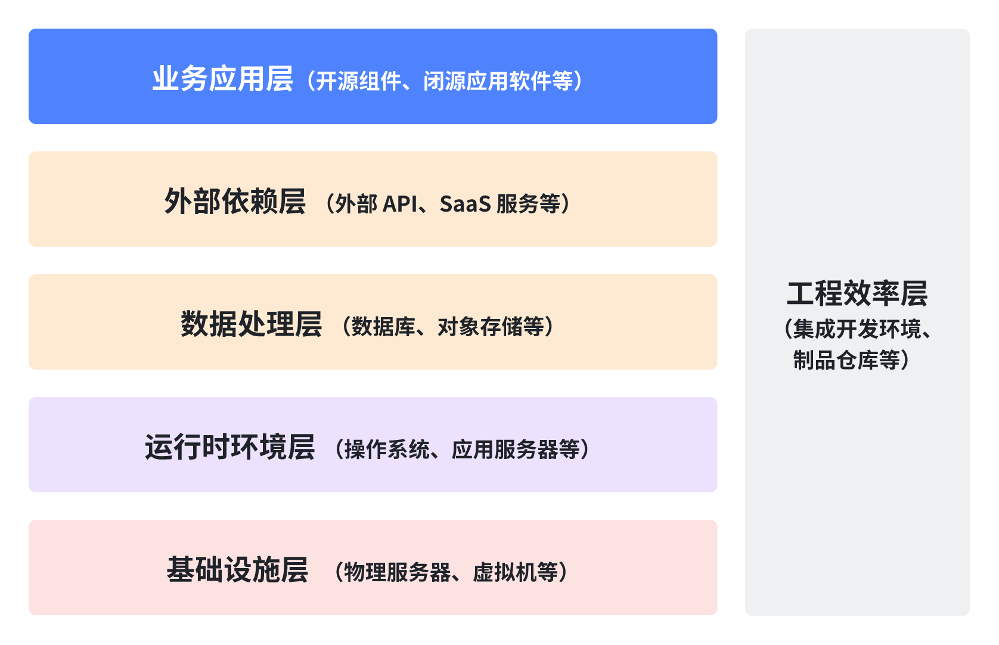

# 企业软件成分分类体系

解决 “软件由什么构成” 的问题，为划定安全边界、开展安全评估提供基础的 “成分视角”。

## 定义

软件成分是指生产、运行一个独立应用服务过程中，使用到的最小独立完整技术模块单元，可以是一个开源组件、SDK、数据库服务、容器、依赖的外部 API 及所有的自研代码等。

## 分类逻辑

<table header_row="1">
<colgroup>
<col width="120"/>
<col width="265"/>
<col width="470"/>
</colgroup>
<thead>
<tr><th>分类级别</th><th>分类名称</th><th>说明</th></tr>
</thead>
<tbody>
<tr><td>一级</td><td><b>资产大类</b></td><td>指最顶层、最宽泛的分类，例如 基础设施层、应用逻辑层等</td></tr>
<tr><td>二级</td><td><b>资产类型 </b></td><td>指在每个资产大类下，更具体的资产类型，例如 开源组件、SDK、数据库系统等。</td></tr>
</tbody>
</table>

## 资产大类

## 资产类型

<table header_row="1">
<colgroup>
<col width="200"/>
<col width="200"/>
<col width="400"/>
</colgroup>
<thead>
<tr><th>资产大类</th><th>资产类型</th><th>说明</th></tr>
</thead>
<tbody>

<tr><td rowspan="8">业务应用层</td><td>自研代码</td><td>企业内部团队自主开发的软件应用源代码，包括前端、后端、移动端等代码</td></tr>
<tr><td>自研组件</td><td>企业内部团队开发的、可复用的软件模块或库</td></tr>
<tr><td>开源组件</td><td>遵循开源许可证发布的、可复用的软件组件或库</td></tr>
<tr><td>闭源组件</td><td>指那些不以开源许可证发布的可复用软件组件或库，最核心的特征是其源代码不公开</td></tr>
<tr><td>SDK</td><td>由软件或服务提供商提供的、用于扩展或增强软件应用自身功能的开发工具包</td></tr>
<tr><td>开源应用软件</td><td>以完整应用程序形式发布，并遵循开源许可证的软件</td></tr>
<tr><td>闭源应用软件</td><td>指以完整应用程序形式发布，不遵循开源许可证的软件。最核心的特征是其源代码不公开</td></tr>
<tr><td>模型</td><td>在软件应用中使用的算法模型或机器学习模型，用于实现特定功能</td></tr>

<tr><td rowspan="3">外部依赖层</td><td>外部 API</td><td>由第三方服务提供商提供的应用程序编程接口，用于集成外部功能或数据到企业自身的软件应用中</td></tr>
<tr><td>SaaS 服务</td><td>以软件即服务模式提供的云端应用程序，企业通过互联网使用这些服务，无需本地部署和维护</td></tr>
<tr><td>外部数据源</td><td>由第三方数据供应商提供的外部数据信息来源</td></tr>

<tr><td rowspan="6">数据处理层</td><td>对象存储</td><td>用于存储海量非结构化数据的软件，擅长存储各种文件类型，如图片、视频和文档</td></tr>
<tr><td>数据计算</td><td>用于执行数据处理和分析任务的软件平台，常用于数据清洗、转换、分析和挖掘等场景</td></tr>
<tr><td>数据库</td><td>用于存储和管理结构化数据的软件</td></tr>
<tr><td>数据分发</td><td>用于在不同系统之间传输和分发数据的软件平台，常用于构建数据管道，实现数据共享和集成的</td></tr>
<tr><td>数据仓库</td><td>用于存储和分析大量历史数据的软件系统</td></tr>
<tr><td>缓存</td><td>用于提供高速数据访问的临时存储软件</td></tr>

<tr><td rowspan="4">运行时环境层</td><td>操作系统</td><td>管理和控制计算机硬件与软件资源的系统软件，例如 Linux, Windows Server</td></tr>
<tr><td>容器运行时</td><td>负责创建和运行容器的底层软件</td></tr>
<tr><td>编程语言运行时</td><td>允许特定编程语言编写的代码得以执行的环境</td></tr>
<tr><td>应用服务器</td><td>为 Web 应用提供运行环境和企业级服务的服务器软件</td></tr>

<tr><td rowspan="3">基础设施层</td><td>物理服务器</td><td>企业自建或租用的物理硬件服务器，用于运行软件应用及相关服务</td></tr>
<tr><td>虚拟机</td><td>基于虚拟化技术创建的虚拟服务器实例，运行在物理服务器之上，提供计算资源</td></tr>
<tr><td>网络设备</td><td>用于构建和管理网络连接的硬件设备，例如路由器、交换机、防火墙、负载均衡器</td></tr>

<tr><td rowspan="5">工程效率层</td><td>集成开发环境</td><td>集成了代码编辑、编译、调试、测试等开发工具的软件应用程序，提高开发效率</td></tr>
<tr><td>代码与版本控制系统</td><td>用于存储、管理和追踪代码版本变更的工具和平台，支持多人协作开发</td></tr>
<tr><td>CI/CD 与自动化系统</td><td>用于自动化软件构建、测试、部署和交付流程的系统和工具，加速软件迭代</td></tr>
<tr><td>构建与依赖管理工具</td><td>用于自动化软件构建过程、管理项目依赖关系的工具</td></tr>
<tr><td>制品仓库</td><td>用于存储和管理软件构建过程中产生的各种制品的系统，例如二进制文件、容器镜像</td></tr>
</tbody>
</table>
